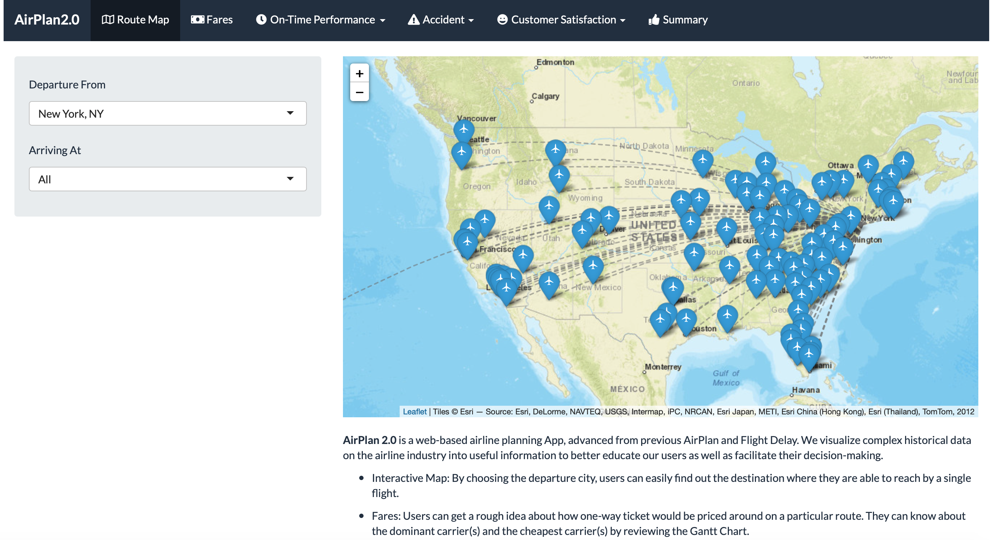
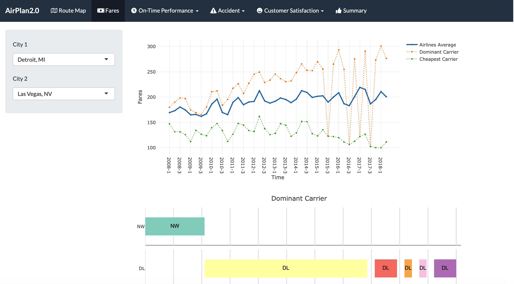
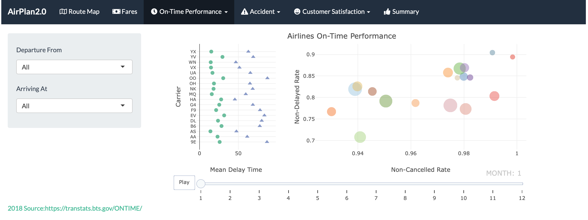
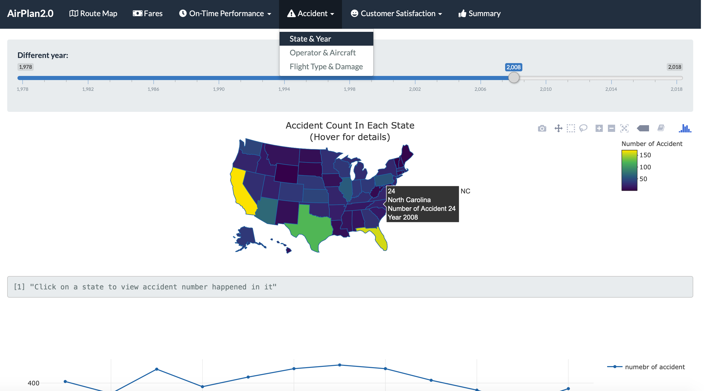
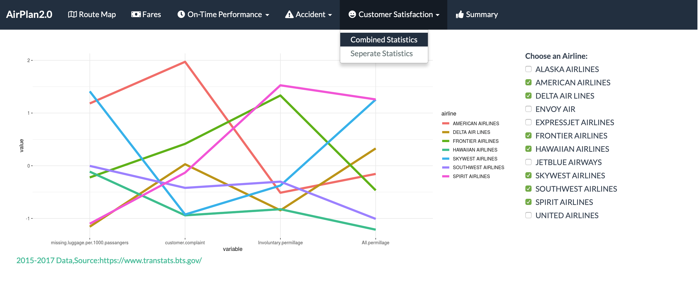
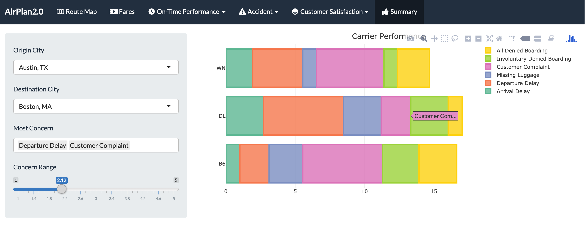

# Project 2: Shiny App Development Version: AirPlan2.0

Hello Travelers. Welcome to our brand new Airline Information App: [AirPlan2.0](https://jw3667.shinyapps.io/test2/). We are **Team No.13**.


## Project Summary:
In this second project of GR5243 Applied Data Science, we develop a version 2.0 of an *Exploratory Data Analysis and Visualization* shiny app on a topic 'Airlines'.

Concerning about planning your trip wisely? AirPlan 2.0 will help our users to effectively review the statistics of the airline industry. We visualize complex historical data into insights towards the airline industry. Fares, on-time performance, accident, and customer satisfaction are selected as criteria for users to have a snapshot of the overall industry and to compare among different airlines.

## Team Members：
- Ren, Claire xr2134@columbia.edu
- Wang, Jingwen jw3667@columbia.edu
- Yao, Yu yy2906@columbia.edu
- Yin, Chao cy2507@columbia.edu
- Zhang, Yue yz3383@columbia.edu
- Chen, Xishi xc2455@columbia.edu

## Contribution Statement: 
All team members contributed equally in all stages of this project. All team members approve our work presented in this GitHub repository including this contributions statement. 

**Chao Yin** works on On-time Performance Panel and Summary Panel, including cleaning data, examing patterns, and designing plot outputs. 

**Jingwen Wang** plots Trend Line Chart part in the Fares Panel, works on Shiny Design of the Fares and On-time Performance Channel, and designs the Interactive Map.


**Yue Zhang** mainly focus on the Accident Panel, including accident data preprocseeing and explorative data analysis of accident data.

## Project Demonstration:

+ Interactive Map:

<p align="center">
  

+ Fares:

<p align="center">


+ On-time Performance:

<p align="center">


+ Accident Statistics:

<p align="center">


+ Customer Satisfaction:

<p align="center">


+ Summary:

<p align="center">



Following [suggestions](http://nicercode.github.io/blog/2013-04-05-projects/) by [RICH FITZJOHN](http://nicercode.github.io/about/#Team) (@richfitz). This folder is orgarnized as follows.

```
proj/
├── app/
├── lib/
├── data/
├── doc/
└── output/
```

Please see each subfolder for a README file.

